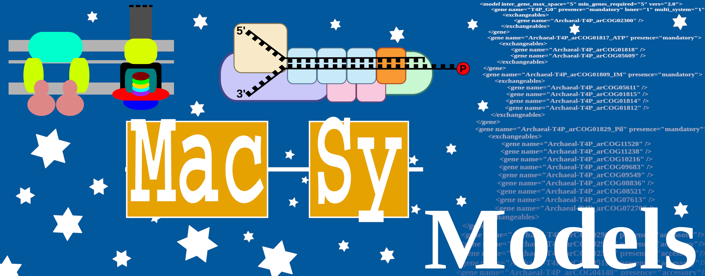

.. MacSyFinder - Detection of macromolecular systems in protein datasets
    using systems modelling and similarity search.
    Authors: Sophie Abby, Bertrand Néron
    Copyright © 2014-2023 Institut Pasteur (Paris) and CNRS.
    See the COPYRIGHT file for details
    MacsyFinder is distributed under the terms of the GNU General Public License (GPLv3).
    See the COPYING file for details.

.. _modeler_guide:

==============
Modeller Guide
==============

Modelling Systems with MacSyFinder
==================================
.. toctree::
   :maxdepth: 2

   package
   modeling
   helper_tools
   publish_package
   gallery
   

Carrying models from v1 to v2
=============================
.. toctree::
   :maxdepth: 2

   models_V1ToV2

Frequently Asked Questions
==========================
.. toctree::
   :maxdepth: 2
   
   FAQ_modeler
