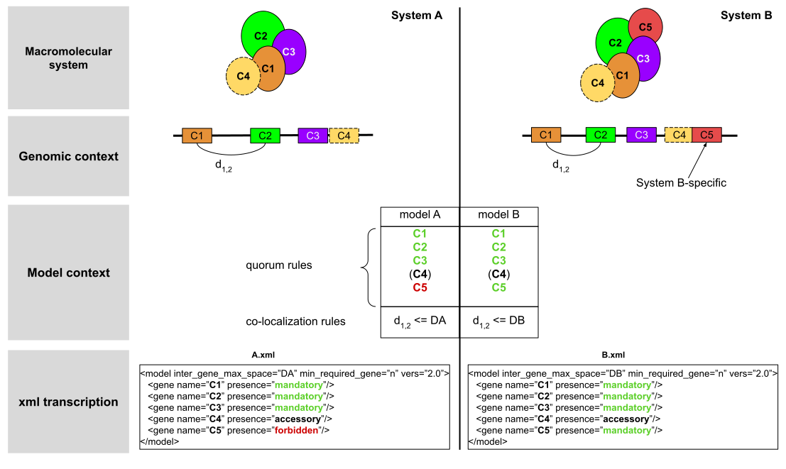

.. MacSyFinder - Detection of macromolecular systems in protein datasets
    using systems modelling and similarity search.            
    Authors: Sophie Abby, Bertrand Néron                                 
    Copyright © 2014-2020 Institut Pasteur (Paris) and CNRS.
    See the COPYRIGHT file for details                                    
    MacsyFinder is distributed under the terms of the GNU General Public License (GPLv3). 
    See the COPYING file for details.  
    
.. _model_definition:

*********************
Macromolecular models
*********************

Principles
==========

MacSyFinder relies on the definition of models of macromolecular systems as a **set of models' components** 
to be searched by similarity search, and a **set of rules** regarding their genomic organization and 
their requirement level to make a complete system (mandatory, accessory components, number of components required). 
See :ref:`section on Functioning <functioning>` for more details on MacSyFinder's modelling scheme and search engine.

A **MacSyFinder model** (macsy-model for short) is thus the association of several elements:

    * a definition which describes the system to detect with a specific **XML grammar** that is described :ref:`below<model-definition-grammar-label>`.
    
    * a set of **HMM profiles** (one per component/gene in the model) to enable the similarity search of the systems' components with the HMMER program.

The models are grouped by *family* possibly gathering *sub-families* (multiple levels allowed), for instance *Secretion*, *Cas-proteins*...
A set of models from a same family (coherent set) of systems to detect is called hereafter a **macsy-model package**.

.. _package_structure:

A macsy-model package follows the following structure ::

    family_name
        |_______ metadata.yml
        |_______ LICENCE
        |_______ README.md
        |_______ definitions
        |            |________ model_1.xml
        |            |________ model_2.xml
        |            :
        |
        |_______ profiles
                     |________ geneA.hmm
                     |________ geneB.hmm

If the package contains sub-families ::

    family_name
        |_______ metadata.yml
        |_______ LICENCE
        |_______ README.md
        |_______ definitions
        |            |________ subfamilyA
        |            |            |________ model_1.xml
        |            |            |________ model_2.xml
        |            |
        |            |________ subfamilyB
        |            |            |________ model_3.xml
        |            |            |________ model_4.xml
        |            |
        |            :
        |
        |_______ profiles
                     |________ geneA.hmm
                     |________ geneB.hmm

For examples of macsy-model packages, please visit https://github.com/macsy-models

How to install new models
=========================

MacSyFinder does not provide models. You must install models before using it.
The ``macsydata`` utility tool is shipped with `MacSyFinder` to deal with macsy-models:

macsydata <subcommand> [options]

The main sub-commands are

* ``macsydata available`` to get the list of macsy-models available
* ``macsydata search`` to search a model given its name or a pattern in its description
* ``macsydata install`` to install a macsy-model package (the installed version can be set see --help)
* ``macsydata cite`` to retrieve information on how to cite the model
* ``macsydata --help`` to get the extended list of available subcommands
* ``macsydata <subcommand> --help`` to get help about the specified subcommand

Where the models are located
============================

MacSyFinder looks at several locations to find macsy-models.

system-wide installation
------------------------

By default *macsydata* installs models in a shared location (set by --install-data option) that is
`/usr/share/macsyfinder/` or `/usr/local/share/macsyfinder` depending on your Operating System distribution.
If you use a *virtualenv*, the shared resources are located in the `<virtualenv>/share/macsyfinder` directory.

user-wide installation
----------------------

If you don't own rights to install system-wide, you can install models in the MacSyFinder's cache
located in your home: `$HOME/.macsyfinder/data/`.
*macsydata* installs packages in this location when you use the `--user` option.
The packages installed in user land is added to the system-wide packages.

.. note::
	If two packages have the same name, the package in the user land supersedes the system-wide package.

project-wide installation
-------------------------

If you cannot install macsy-model packages in system or user land locations, you can specify a
specific location with the ``--models-dir`` :ref:`command-line option <path-options>`. The path must point at a directory
that contains macsy-model packages as described :ref:`above <package_structure>`.

 .. _model_package:

Writing my own macsy-model package
==================================

The whole package structure is described :ref:`above <package_structure>` and requires five different types of files described below to be complete:

* a metadata file
* a README.md file
* a LICENCE file
* macsy-models definition(s)
* HMM profiles

metadata file
-------------

This file contains some meta information about the package itself.
It is in `YAML <https://en.wikipedia.org/wiki/YAML>`_ format and must have the following structure:

.. code-block:: yaml

    ---
    maintainer:
      name: The name of the person who maintains/to contact for further information. (required)
      email: The email of the maintainer (required)
    short_desc: A one line description of the package (can e.g. be used for *macsydata* searches) (required)
    vers: The package version (required)
    cite: The publication(s) to cite by the user when the package is used (optional, used by `macsydata cite`)
    doc: Where to find extended documentation (optional)
    licence: The licence under the package is released (optional but highly recommended)
    copyright: The copyright of the package (optional)

For example:

.. code-block:: yaml

    ---
    maintainer:
       name: first name last name
       email: login@my_domain.com
    short_desc: Models for 15 types of secretion systems or bacterial appendages (T1SS, T2SS, T3SS, T4P, pT4SSt, pT4SSi, T5aSS, T5bSS, T5bSS, T6SSi, T6SSii, T6SSiii, Flagellum, Tad, T9SS).
    vers: 0.0a1
    cite:
       - |
         Abby Sophie S., Cury Jean, Guglielmini Julien, Néron Bertrand, Touchon Marie, Rocha Eduardo P. C. (2016).
         Identification of protein secretion systems in bacterial genomes.
         In Scientific Reports, 6, pp. 23080.
         http://dx.doi.org/10.1038/srep23080
    doc: https://github.com/macsy-models/TXSS
    licence: CC BY-NC-SA 4.0 (https://creativecommons.org/licenses/by-nc-sa/4.0/)
    copyright: 2014-2020, Institut Pasteur, CNRS

.. warning::
    This `metadata.yml` file is **mandatory**. Without this file your archive/repository will not be considered as a *macsy-model package*.

.. note::

    * *-* specify an item of yaml list
    * *|* is used to specify a single item but over multiple lines.

README.md
---------

A description of the package: what kind of systems the package models, how to use it etc... in `markdown <https://guides.github.com/features/mastering-markdown/>`_ format.

LICENCE
-------

The licence use to protect and share your work.
If you don't know which licence to choose, have a look at `CreativeCommons <https://creativecommons.org/share-your-work/>`_
*This file is optional, but highly recommended.*

Writing my own macsy-models definitions
---------------------------------------

(*e.g.*, 'T1SS.xml' for T1SS, the Type 1 Secretion System) by a set of **components**
(*i.e.* proteins, or protein-coding genes given the context) with different attributes and that are used
for **content description**.
Features regarding **co-localization** parameters for system detection are also defined in this system-specific file.

Four distinct types of components can be used to model a given system content,
and which corresponds to Gene objects, and the corresponding HMM protein profiles.

* **mandatory** components represent essential components to be found to infer the System presence.
* **accessory** components correspond to components that can be found in some systems occurrence,
  or quickly evolving components that are hard to detect with a single profile.
* **neutral** components are used to build the clusters (genetically close components) but not taken into account to assess the system's presence. ``NEW in V2``
* **forbidden** components are components which presence is eliminatory for the system's assessment.

.. _model-definition-grammar-label:

The XML hierarchy
"""""""""""""""""

* The element root is "model".

  * It has a mandatory attribute: "inter_gene_max_space", an integer representing the maximal number of components
    without a match between two components with a match for a component profile.
  * the version of the xml grammar (the actual version is "2.0")
  * The element "model" may have attributes:
  
     * **min_mandatory_genes_required**: an integer representing the minimal number of mandatory genes required
       to infer the system presence.
     * **min_genes_required**: an integer representing the minimal number of mandatory or accessory genes
       (whose corresponding proteins match a profile of the model) required to infer the system presence.
     * **max_nb_genes**: an integer representing the maximal number of mandatory or accessory genes in the system.
     * **multi_loci**: a boolean set to True ("1", "true" or "True") to allow the definition of "scattered" systems
       (systems encoded by different loci). If not specified, *default value is false*.
     
  * The model contains one or more element "gene".
  
* The element "gene" has several mandatory attributes: 

   * **name**: which must match to a profile in the profile directory.
   * **presence**: which can take three values "mandatory", "accessory", "neutral", "forbidden".

 The element "gene" may have other attributes: 

   * **loner**: which is a boolean. If a gene is loner that means this gene can be isolated on the genome ( *default false* ).
   * **exchangeable**: which is a boolean. If a gene is exchangeable (value set to "1", "true" or "True") that
     means this gene or one of its homologs or analogs can be interchanged for the assessment of the presence
     of the macromolecular system ( *default false* ).
   * **multi_system**: which is a boolean. If a gene is "multi_system" (value set to "1", "true" or "True"),
     it means that it can be used to fill by multiple systems occurrences. ( *default false* ).
   * **inter_gene_max_space**: an integer that defines gene-wise value of system's "inter_gene_max_space" parameter (see above).

 The element "gene" may have one "exchangeables" child element:

* The element "exchangeables" can contains one or more elements "gene".

Example of a model definition in XML:

.. code-block:: xml
  
  <model inter_gene_max_space="5" ver="2.0">
    <gene name="gspD" presence="mandatory">
       <exchangeables>
           <gene name="sctC"/>
       </exchangeables>
    </gene>
    <gene name="sctN_FLG" presence="mandatory" loner="1"/>
       <exchangeables>
           <gene name="gspE"/>
           <gene name="pilT"/>
       </exchangeables>
    <gene name="sctV_FLG" presence="mandatory"/>
    <gene name="flp" presence="accessory"/>
  </model>

.. warning::
  
    * a gene is identified by its name.
    * this name is case sensitive.
    * this name must be unique inside a family of models.
    * a hmm profile with the same name must be exists in the `profiles` directory

Provide hmm profiles
--------------------

For each gene mentioned in each model you have to provide a hmm profile
that capture this gene. The hmm profile must be created from specific alignment with `hmmbuild`
from `HMMER package <http://hmmer.org/>`_.
This profile *MUST* have the same name as the name of the gene mentioned in the definition.
The names are Case sensitive. All the profile must be placed in the `profiles` directory.

Share your models
=================

If you want to share your models you can create a :ref:`macsy-model package <model_package>` in your github repository
check the validity of your package with the ``macsydata check`` command
create a tag and the submit a pull request to https://github.com/macsy-models organization.
So once your PR will be accepted the model package will be automatically available through the macsydata tool.
If you don't want to submit a PR you can provide the tag release tarball (tar.gz) as is to your collaborators.
The archive is also usable with the `macsydata` tool.
